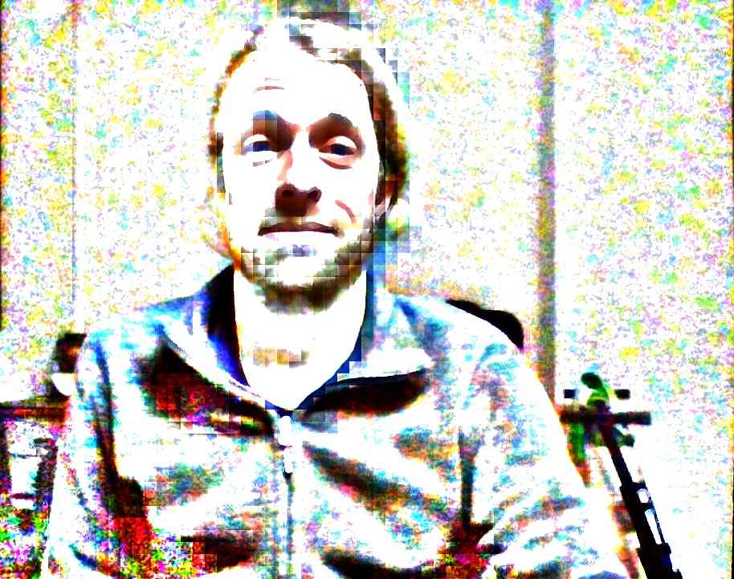

### The Billionth Introduction to Python

Hi there everybody,

Welcome to The Billionth Introduction to Python. My name is Jonathan Forrest Sherman, and I'm going to try to help you become familiar with Python and some of its core packages, such as Numpy and Matplotlib. In particular, this short introduction will be helpful to those looking to jumpstart into typical Pythonic fields such as data science and machine learning. But we don't do any of that here quite yet, otherwise we wouldn't qualify for the Billionth Introduction to Python, but only the 100 millionth introduction to data science, or the 10 millionth introduction to machine learning. Thanks for your understanding!



### Prerequisites of knowledge and programming environment setup (skip if you already have Python, Anaconda and Jupyter Notebook)

Good news! You don't need to have any knowledge whatsover to take the Billionth Introduction to Python. You have been born on this planet. Therefore you must learn Python. That is our motto. 

**[Install Python 3.6 here](https://www.python.org/downloads/)** and find its documentation [here](https://docs.python.org/3/)

Verify that Python 3 and PIP are installed correctly by opening your terminal/command line editor and running
```python --version```
and
```pip --version```

Hopefully, these both show the version of Python3 you just installed. If not, try
```python3 --version```
and
```pip3 --version```

**Jupyter Notebook** allows us to run Python and Tensorflow interactively in a web browser. If you are without it, [please follow the basic installation instructions here](https://jupyter.readthedocs.io/en/latest/install.html). 

If the install is successful, you should be able to open a "notebook" in your browser by executing the following command in your terminal/command line prompt (if you are on Windows you should use the Anaconda prompt)

### Message to the learner

*Note that we are using the term **familiarity**, and not something like "mastery".* There are 2 points: the 1st is that you will get better as you go along, so be patient with yourself if you don't understand it all at once. In fact, if you are new to this it would be very surprising if you did. The 2nd point is to remind yourself of the 1st point. 

Also, it doesn't matter, at least to me, whether you are good at math, bad at math, can't even count your toes, or whatever. Programming is also a language, and language is for everyone. That's why this is the Billionth Introduction to Python. So learn the language, or otherwise you won't know what they are saying about you.

### Lesson contents

You have the option of video, jupyter notebook or both together to take the lesson. However, you'll probably learn best, at least the first time, by coding along with the video lesson from an empty jupyter notebook.

| Section | Video |
|---------|-------|
| Basic operations | -- |
| Data types and conversion | -- |
| Packages and modules | -- |
| Reading and writing files | -- |
| Numpy and Matplotlib | -- |

So, for the zillionth time, let's get started..

### Tasks: To test your understanding and familiarity with the basic techniques of the Billionth Introduction to Python, you can:
1. Write a function 1hat returns a different result depending if its argument is greater or less than some value, and throws an error if the argument is a string
2. Write a function that scrambles the words of poem.txt and saves it as a newly named txt file.

### For further learning:

**[Jupyter Notebook shortcuts](https://towardsdatascience.com/jypyter-notebook-shortcuts-bf0101a98330)
**[Stanford CS231n Python-Numpy tutorial](http://cs231n.github.io/python-numpy-tutorial/)**

### Disclosure: This mini online course was designed and produced to fulfill the requirement of “e-learning” offered by Professor Shelley Shwu-ching Young, at National Tsing Hua University, Taiwan, Spring semester, 2008. 


